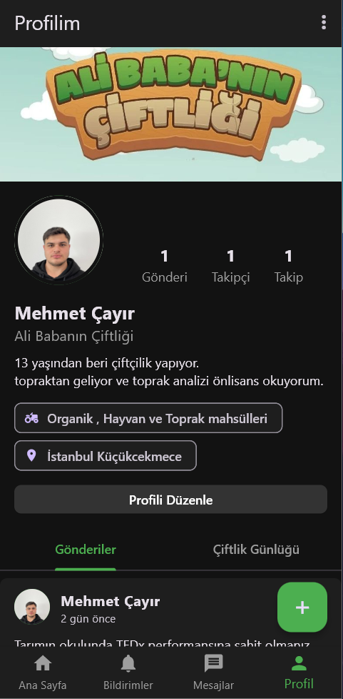
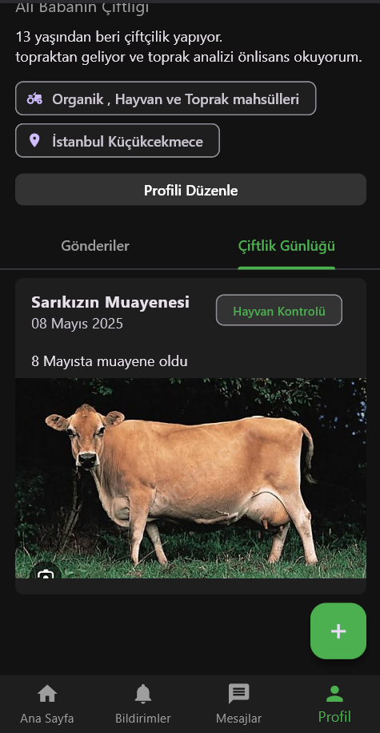
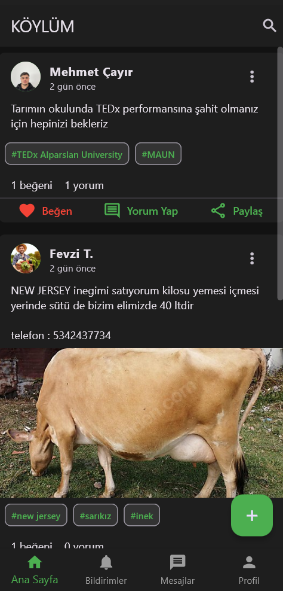
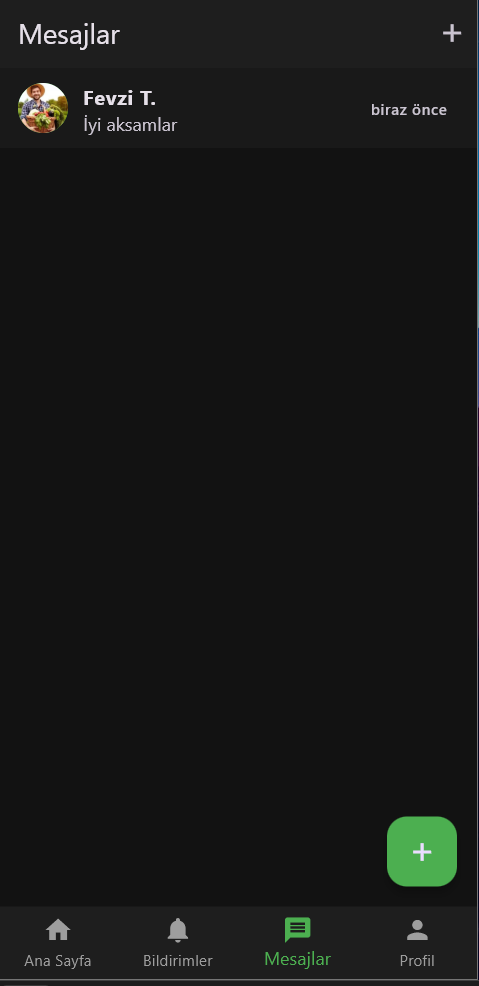
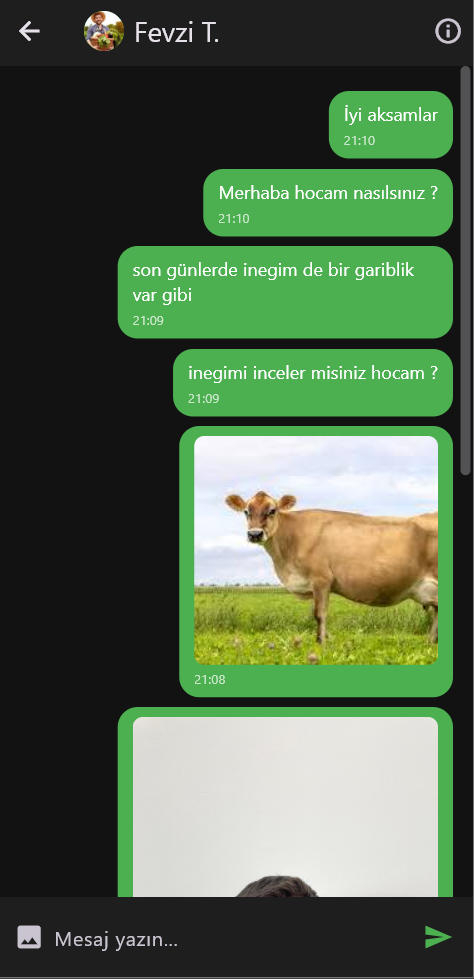
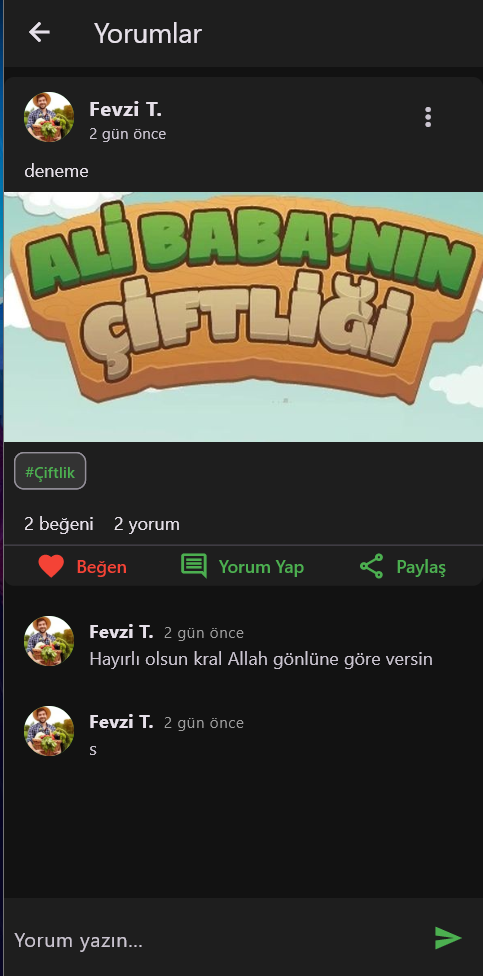

# 🚜 KÖYLÜM - Sosyal Medya Uygulaması

Bu mobil uygulama, çiftçilerin , ziraatcilerin , tarımseverlerin ve Tüccarların  kendi içeriklerini paylaşabildiği, ürünlerini tanıtabildiği, satabildiği ve toplulukla etkileşim kurabildiği sosyal medya tabanlı bir platformdur.

Flutter ile geliştirilen bu uygulama, çiftçilikle ilgilenen herkesin bir araya gelebileceği dijital bir köy meydanı işlevi görür.

---

## 📱 Özellikler

- 👤 **Profil Sayfası:** Kullanıcılar biyografi, uzmanlık alanları ve konum bilgilerini paylaşabilir.
- 🐄 **Gönderiler:** Metin, etiket ve görsel destekli gönderi paylaşımı.
- ❤️ **Etkileşim:** Beğenme, yorum yapma ve gönderi paylaşma özelliği.
- 🛎️ **Bildirimler:** Yeni yorumlar, beğeniler ve takiplerle ilgili bilgilendirme.
- 💬 **Mesajlaşma:** Kullanıcılar arasında özel mesaj gönderimi 
- 📓 **Çiftlik Günlüğü:** Kullanıcılar tarımsal tecrübelerini günlük olarak yazabilir.

---

## 🧑‍🌾 Hedef Kitle

- Çiftçiler
- Tüccarlar
- Ziraatçiler
- Kırsal girişimciler
- Hayvancılık ve tarımla ilgilenen bireyler

---

## 🛠️ Teknolojiler

- **Flutter** – UI geliştirme
- **Dart** – Ana yazılım dili
- **Supabase** – Backend (veritabanı, kimlik doğrulama)

---

## 📸 Örnek Görseller

### Profil Sayfası

### Ana Sayfa (Köylüm)

### Mesajlasma

### Gönderiler

---

